# MegaShop

Full-featured e-commerce platform (Currys / Best Buy / DNS style) built with Django.
Custom admin panel, multi-role auth, TOTP 2FA, multi-store management, HR employee system, and Docker infrastructure.

## Quick Start

### Prerequisites

- [Docker Desktop](https://www.docker.com/products/docker-desktop/) (4 GB RAM minimum)
- Git

### Launch

```bash
git clone https://github.com/AnonimPython/MegaShop
cd megashop

# Start all services
docker compose up -d --build

# Apply database migrations
docker compose exec web python manage.py migrate

# Seed demo data (admin, 7 categories, 12 products, 3 stores, spec fields, exchange rates)
docker compose exec web python seed_data.py
```

### Access

| URL                                   | Description                                         |
| ------------------------------------- | --------------------------------------------------- |
| http://localhost:8000/                | Storefront (catalog, search, cart)                  |
| http://localhost:8000/admin-panel/    | Admin panel (redirects to 2FA setup on first login) |
| http://localhost:8000/accounts/login/ | Login page                                          |

### Default Credentials

| User      | Password     | Role                                                          |
| --------- | ------------ | ------------------------------------------------------------- |
| `admin` | `admin123` | Superuser (2FA not set — set up on first admin panel access) |

For other roles (staff, hr_manager, expansion_manager), create via admin panel → Staff accounts.

## First-Time Login Flow

1. Go to http://localhost:8000/accounts/login/
2. Log in with `admin` / `admin123`
3. Try accessing `/admin-panel/` — you'll be redirected to `/accounts/otp/setup/`
4. Scan the QR code with **Google Authenticator**
5. Enter the 6-digit code to confirm
6. You now have full admin panel access

After 2FA is enabled, every login requires a valid TOTP code.

## Screenshots

### Storefront

| | |
|---|---|
| **Main page** — category grid with hero banner, search bar, mega menu catalog, and store selector | **Product detail** — description, dynamic specs table, DNS-style reviews (pros/cons/overall), related products, and multi-currency pricing |
| 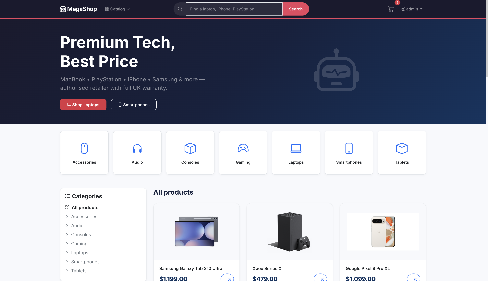 | 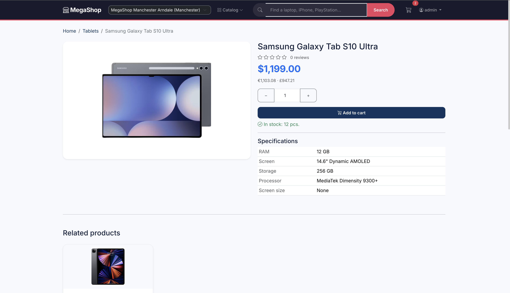 |
| **Category page** — product cards with USD price, sort and filter options | **Cart** — items with quantities, total price, checkout button |
| 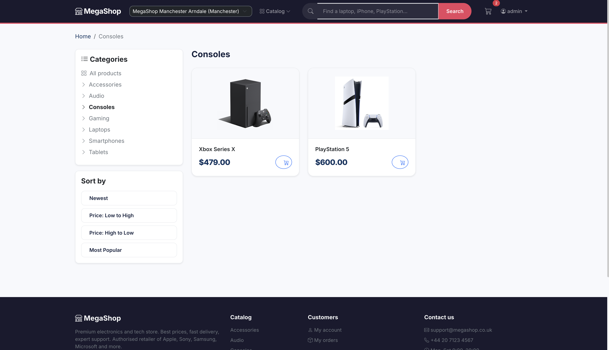 | 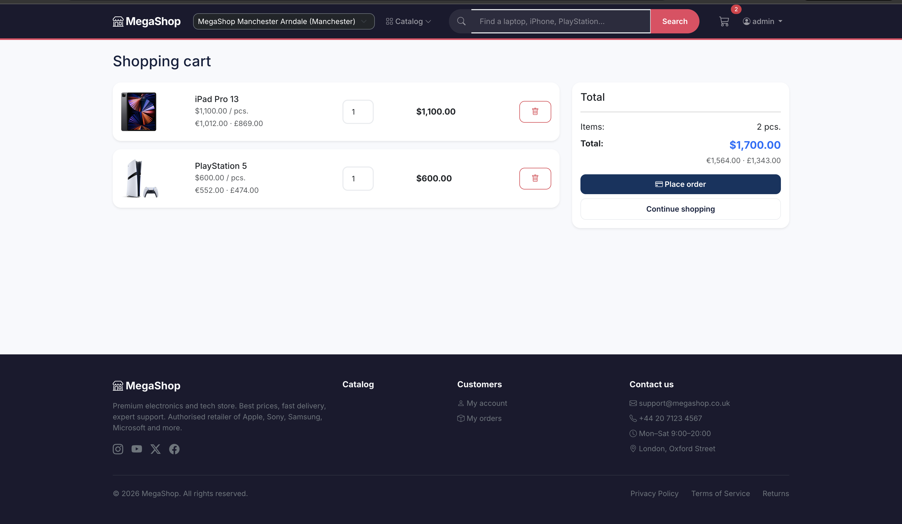 |
| **Checkout** — delivery type cards (pickup / home delivery) with store search | **Order confirmation** — order details with items, delivery info, and status |
| 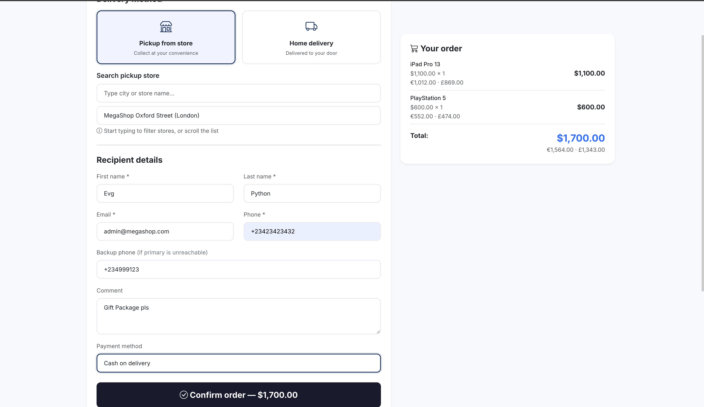 | 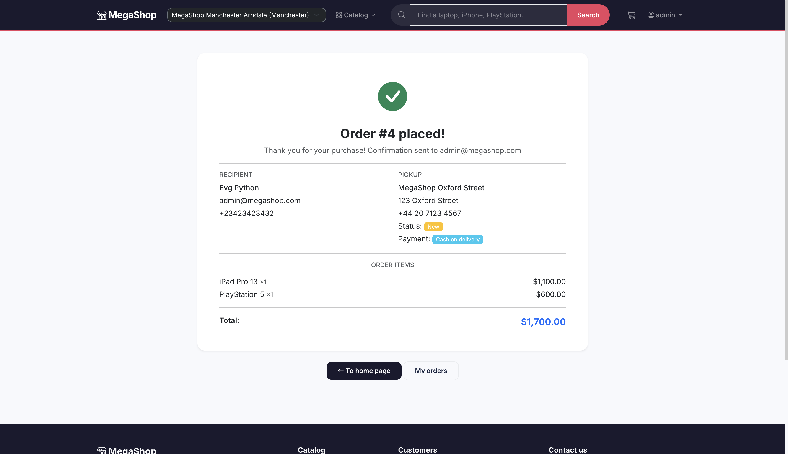 |

### Admin Panel

| | |
|---|---|
| **Dashboard** — stats overview (products, orders, revenue, low stock), recent orders | **Product list** — table with image, price, stock, category; CSV export |
| 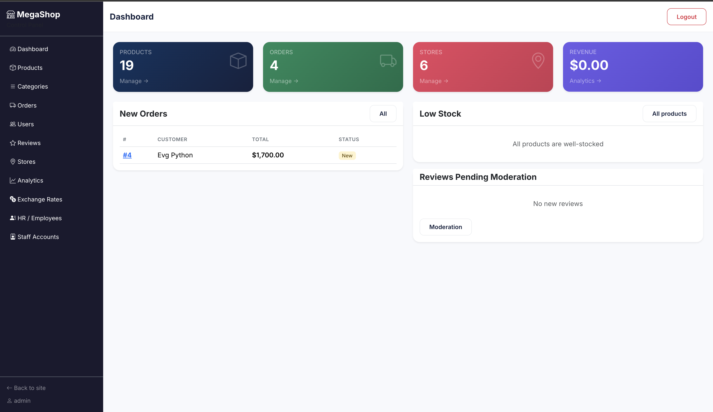 | 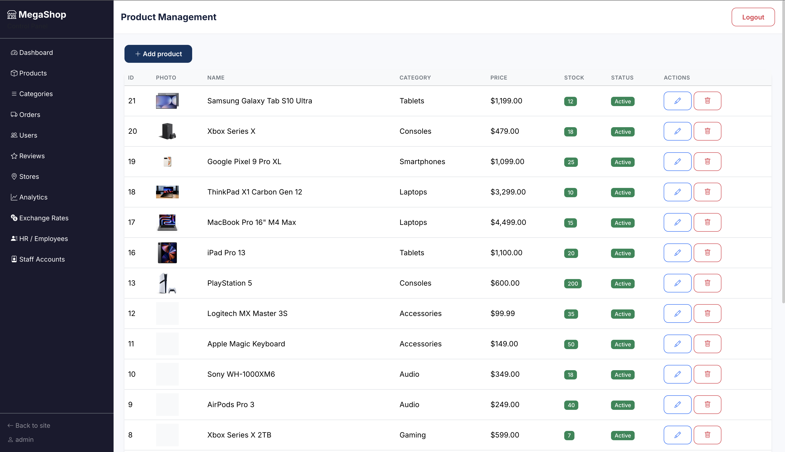 |
| **Category management** — create/edit categories with spec fields per category | **Order management** — order list with status, total, delivery type; status update |
| 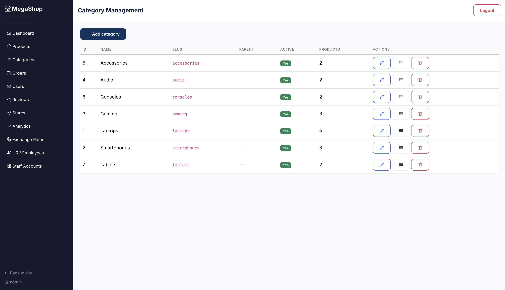 | 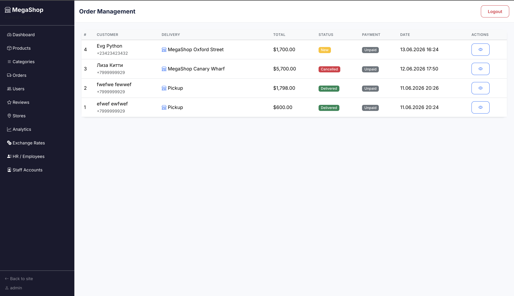 |
| **Store management** — multi-store CRUD with staff roles and per-store stock | **Employee management** — HR employee profiles with documents and payroll |
| 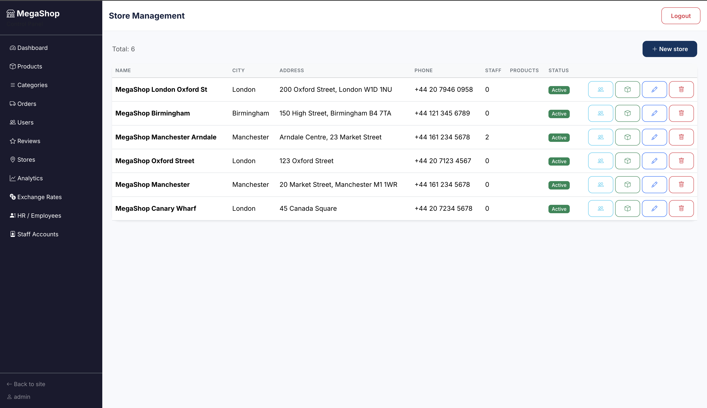 | 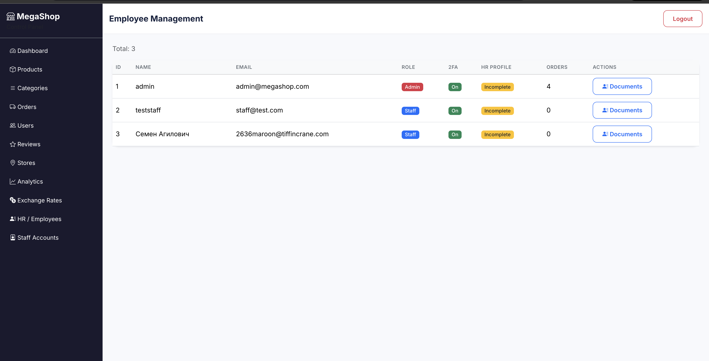 |
| **Analytics** — revenue charts, top products, monthly/yearly Excel export | |
| 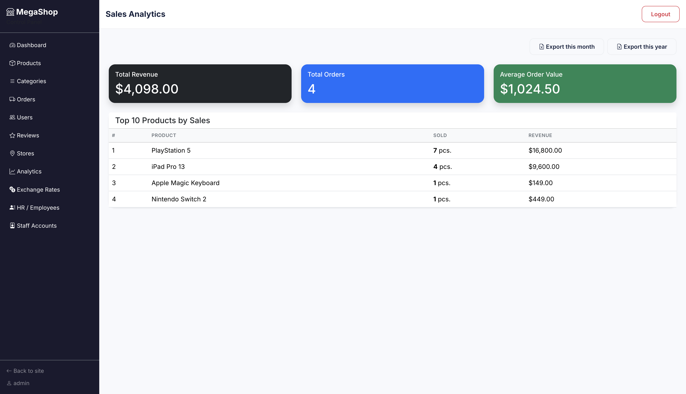 | |

## Features

### Catalog

- Categories with recursive subcategory support
- Products with price, old price, stock, JSON specifications, warranty, multiple images
- Search, category filter, sort by popularity/price/newest
- **CSS-only mega menu** — hover-activated full-width category grid in the header
- Product view tracking for popularity sorting

### Cart & Orders

- Session-based cart with quantity management
- Order lifecycle: pending → processing → shipped → delivered → cancelled
- **Two delivery modes**: pickup from store (with searchable store selector) and home delivery (floor, apartment, backup phone)
- Order items store price snapshots
- Email notifications via Celery (RabbitMQ broker)

### Reviews

- **DNS-style three-field review**: What I liked (pros), What I did not like (cons), Overall impression
- One review per user per product
- Moderation flow — user sees their review even before moderation; others see only approved
- Rating from 1 to 5 stars

### Multi-Currency

- All prices in USD (base), automatically converted to EUR and GBP
- Exchange rates manageable via admin panel
- USD shown on product cards; EUR/GBP on detail page

### Geo IP Detection

- Automatically detects user's country and city via free ip-api.com
- Suggests the nearest store based on detected city
- Results cached in session (no repeated API calls)
- Works on public IPs only (disabled for localhost/private IPs)

### Store Management (Expansion Manager)

- Multi-store support with city, address, phone, work hours
- Store staff assignment with roles (manager, sales, stock)
- Per-store stock management with StoreProduct model

### Admin Panel

- Dashboard with order/revenue/product stats
- CRUD for products, categories, orders, reviews, stores, exchange rates
- **Category-first product creation** — select a category from visual tiles, then fill in product + spec fields
- **Dynamic spec fields** — per-category specification fields (text, number, boolean) defined in admin, auto-rendered on the product form and detail page
- Store staff and stock management
- CSV export with BOM for Excel
- **Excel sales export** — monthly/yearly reports with styled headers and summaries
- Role-based sidebar (stores hidden from plain staff, HR visible only to hr_manager+superuser)

### Staff & HR

- **Superuser**: full access, manage staff accounts, reset 2FA
- **HR Manager**: manage employee profiles, documents, payroll
- **Expansion Manager**: create/edit stores, assign staff
- **Staff**: manage products, orders, reviews
- Employee profile: passport / NI (UK) / SSN (US), right-to-work docs, proof of address, bank details, emergency contact, job info
- Document uploads (right-to-work, proof of address)

### Security

- Argon2 password hashing (primary)
- TOTP 2FA (Google Authenticator) — mandatory for all staff
- Remember-me toggle (30-day session vs 7-day)
- CSRF protection with `CSRF_USE_SESSIONS = True`
- Session-based authentication with Redis cache backend

## Project Structure

```
megashop/
├── apps/
│   ├── accounts/        # Custom User model, auth, registration, 2FA, HR/employee profiles
│   ├── admin_panel/     # Custom admin dashboard & full CRUD for all models
│   ├── catalog/         # Categories, products, exchange rates, spec fields, context processors
│   ├── cart/            # Session-based cart
│   ├── geo/             # Geo IP detection context processor
│   ├── orders/          # Orders, order items, delivery types, Celery emails
│   ├── reviews/         # DNS-style reviews (pros/cons/overall), moderation
│   ├── stores/          # Multi-store, staff roles, per-store stock
│   └── analytics/       # ClickHouse integration (extendable)
├── config/
│   ├── settings.py      # All settings (DB, cache, Celery, Argon2, context processors)
│   ├── urls.py          # Root URL config
│   ├── celery.py        # Celery app + beat schedule
│   └── logging_setup.py # Loguru configuration
├── templates/           # All templates (English UI)
│   ├── base.html        # Root with header (mega menu, search, geo, auth) + footer
│   ├── accounts/        # Login, register, profile, 2FA, staff, HR
│   ├── admin_panel/     # Dashboard, CRUD forms, list views, sidebar
│   ├── catalog/         # Product list (hero, categories, cards), detail (specs, reviews)
│   ├── cart/            # Cart page
│   ├── orders/          # Checkout (delivery type cards), order list/detail
│   ├── reviews/         # (templates inline with catalog detail)
│   └── includes/        # Header, footer fragments
├── static/              # CSS (Bootstrap 5 + custom), JS
├── tests/               # 60+ pytest tests (all passing)
├── docker-compose.yml   # 7 services
├── Dockerfile / Dockerfile.dev
├── requirements.txt
├── seed_data.py         # Demo data seeder
└── pytest.ini
```

## Docker Services

| Service           | Image              | Port        | Purpose               |
| ----------------- | ------------------ | ----------- | --------------------- |
| `web`           | Django + runserver | 8000        | Main application      |
| `db`            | PostgreSQL 17      | 5432        | Primary database      |
| `redis`         | Redis 7            | 6379        | Cache + Celery broker |
| `rabbitmq`      | RabbitMQ 4         | 5672, 15672 | Celery message broker |
| `clickhouse`    | ClickHouse         | 8123, 9000  | Analytics backend     |
| `celery_worker` | Celery             | —          | Async task worker     |
| `celery_beat`   | Celery beat        | —          | Scheduled tasks       |

## Testing

```bash
# Run all 60+ tests (uses SQLite in-memory, no Docker needed)
python -m pytest tests/ -q

# With coverage
python -m pytest tests/ --cov=apps -q
```

## Environment Variables

All have sensible defaults in `config/settings.py`. Key overridable variables:

| Variable                                                                | Default                    | Description       |
| ----------------------------------------------------------------------- | -------------------------- | ----------------- |
| `SECRET_KEY`                                                          | `dev-secret-key`         | Django secret key |
| `DEBUG`                                                               | `True`                   | Debug mode        |
| `DB_NAME` / `DB_USER` / `DB_PASSWORD` / `DB_HOST` / `DB_PORT` | PostgreSQL connection      |                   |
| `REDIS_URL`                                                           | `redis://redis:6379/1`   | Redis cache       |
| `CLICKHOUSE_HOST` / `CLICKHOUSE_DB`                                 | ClickHouse connection      |                   |
| `DEFAULT_FROM_EMAIL`                                                  | `noreply@megashop.local` | Email sender      |

## Login Flows

| Scenario          | What happens                                                                       |
| ----------------- | ---------------------------------------------------------------------------------- |
| Admin with no 2FA | Login → redirect to `/accounts/otp/setup/` on admin panel → scan QR → set 2FA |
| Admin with 2FA    | Login → enter TOTP code → admin panel                                            |
| Staff with 2FA    | Same as admin — 2FA mandatory for all staff                                       |
| Regular user      | Login → catalog (no 2FA)                                                          |

## Key Technical Decisions

- **Category.get_descendants()** — recursive queryset, no django-mptt dependency
- **OTP setup** — temporary secret stored in session, saved to DB only after successfull code verification
- **Delivery system** — pickup uses `pickup_store` FK + existing `store` FK; home delivery uses address fields
- **Spec fields** — stored in existing `specifications` JSONField (no schema migration)
- **Mega menu** — positioned absolute relative to navbar, JS 200ms delay for hover
- **Geo IP** — ip-api.com (free, no key), session-cached, disabled for private IPs

## API Endpoints

This project uses Django views (not REST). Key endpoints:

| Method   | Path                                          | Description                                 |
| -------- | --------------------------------------------- | ------------------------------------------- |
| GET/POST | `/accounts/login/`                          | Login (email-or-username + TOTP)            |
| GET/POST | `/accounts/register/`                       | User registration                           |
| GET      | `/catalog/`                                 | Product list (search, filter, sort)         |
| GET      | `/catalog/category/<slug>/`                 | Category product list                       |
| GET      | `/catalog/product/<slug>/`                  | Product detail with reviews                 |
| GET/POST | `/accounts/otp/setup/`                      | 2FA setup (QR + code confirmation)          |
| GET      | `/admin-panel/`                             | Admin dashboard                             |
| GET      | `/admin-panel/products/create/`             | Product creation (category chooser → form) |
| GET/POST | `/admin-panel/products/create/?category=X`  | Product form with spec fields for category  |
| GET      | `/admin-panel/categories/<id>/spec-fields/` | Manage spec fields per category             |
| GET/POST | `/accounts/hr/employees/`                   | HR employee list                            |
| GET/POST | `/accounts/hr/employees/<id>/`              | HR employee detail + documents              |
| GET/POST | `/accounts/staff/create/`                   | Create staff (superuser only)               |
| GET      | `/admin-panel/analytics/`                   | Analytics dashboard                         |
| GET      | `/admin-panel/analytics/export/month/`      | Excel sales report (current month)          |
| GET      | `/admin-panel/analytics/export/year/`       | Excel sales report (current year)           |
